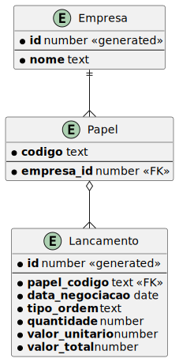
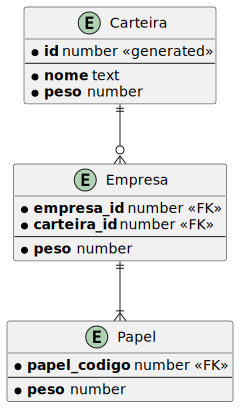

## Objetivo

Oferecer uma API para gerenciamento de ativos financeiros, dando uma nota para cada um deles, a partir da nota a ferramenta 
calculará o percentual que a pessoa pode se expor no ativo. 
A ferramenta deve mostrar também o valor máximo de exposição com base na porcentagem calculada e no patrimônio atual.

- Deve ser possível criar uma "Carteria" e atribuir uma nota a ela.
- Deve ser possível adicionar "Empresas" pertencentes a "Carteira", atribuindo uma nota a "Empresa"
- Deve ser possível adicionar "Papeis" a "Empresa", adicionando uma nota ao "Papel"
- Deve ser possível gerenciar "Lançamentos"

---

## Módulos

### Módulo de cadastro:

Módulo com a resposabilidade de cadastrar as empresas possíveis de se utilizar
nas carteiras e os lançamentos.

Aqui podem ser feitos cadastros de empresas que não necessáriamente serão utilizadas em alguma carteira.

### Módulo de gerenciamento de carteira:

Módulo onde é possível atribuir um peso as empresas e papeis.

A independência com o módulo de cadastro é importante para permitir
a fácil movimentação de empresas entre carteiras sem a necessidade do recadastramento dos lançamentos.

