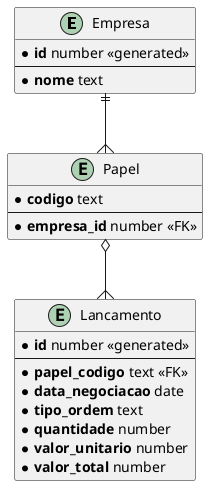

```plantuml
@startuml
entity Empresa {
   * **id** number <<generated>>
  --
   * **nome** text
}

entity Papel {
   * **codigo** text
  --
   * **empresa_id** number <<FK>>
}

entity Lancamento {
   * **id** number <<generated>>
  --
   * **papel_codigo** text <<FK>>
   * **data_negociacao** date
   * **tipo_ordem** text
   * **quantidade** number
   * **valor_unitario** number
   * **valor_total** number
}

Empresa ||--{ Papel
Papel o--{ Lancamento
@enduml
```