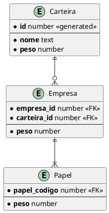

```plantuml
@startuml
entity Carteira {
   * **id** number <<generated>>
  --
   * **nome** text
   * **peso** number
}

entity Empresa {
   * **empresa_id** number <<FK>>
   * **carteira_id** number <<FK>>
   ---
   * **peso** number
}

entity Papel {
   * **papel_codigo** number <<FK>>
   ---
   * **peso** number
}

Carteira ||--o{ Empresa
Empresa ||--|{ Papel
@enduml
```